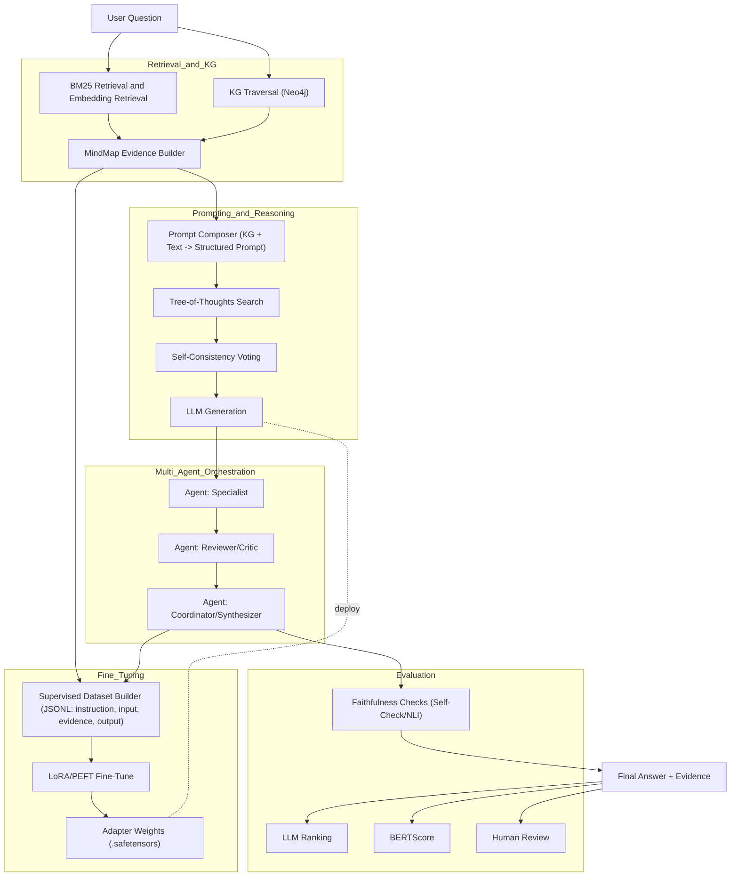

# Enhancing QA Systems through Integrated Reasoning over Knowledge Bases and Large Language Models

A **research-grade**, reproducible system that fuses **structured knowledge graphs (KG)** with **LLM-based reasoning** to reduce hallucination, improve faithfulness, and deliver **auditable** answers in knowledge-intensive domains (medical QA case study included).

> This repository packages the methods of my thesis, *Enhancing Question Answering Systems through Integrated Reasoning over Knowledge Bases and Large Language Models*, into an engineering-ready implementation: modular code, scripts, notebooks, and guidance to adapt to your own domain KG. It is written to satisfy both **academic reproduction** and **practitioner deployment**.

---

## 🔑 Highlights

- **KG-Augmented Tree-of-Thoughts (KG+ToT):** Unifies symbolic KG paths with neural ToT exploration to boost **interpretability** and **faithfulness** vs. RAG/CoT baselines.
- **Multi-Agent QA:** Role-specialized agents (Specialist → Reviewer/Critic → Coordinator) enforce **review-before-synthesis** and safer decisions.
- **Evidence-grounded prompting (MindMap):** Structures entities, relations, multi-hop KG paths, and supporting passages into **first-class evidence** in prompts.
- **Comprehensive evaluation:** **LLM ranking**, **BERTScore**, and **Self-Check/NLI** for semantic alignment, contradiction, and factual support.
- **Reproducible packaging:** Clear repository layout, environment files, CLI entrypoints, smoke tests, and **CITATION** metadata.

---

## 🧭 Architecture (Mermaid)



This diagram is Mermaid-safe for GitHub: nodes are declared first, subgraphs use ASCII titles, and edges are defined after declarations.

---

## 📂 Repository Structure

```
enhancing-qa-kg-llm/
├── src/
│   ├── agents/               # Multi-agent orchestration & pipeline
│   ├── retrieval/            # BM25 & Neo4j utilities
│   ├── reasoning/            # MindMap / KG+ToT logic (mindmap.py)
│   ├── evaluation/           # Metric wrappers (placeholders + notebooks)
│   ├── finetuning/           # (stubs) LoRA/PEFT configs, scripts
│   └── utils/
├── scripts/                  # run_agent / build_kg / evaluate
├── notebooks/                # bert.ipynb, gptranking.ipynb
├── configs/                  # YAML configs (model, data, KG)—add yours
├── data/                     # Your datasets (kept out of VCS)
├── docs/                     # thesis.pdf, diagrams
├── tests/                    # smoke tests
├── requirements.txt
├── environment.yml
├── .env.example
├── CITATION.cff
├── LICENSE
└── README.md
```

---

## ⚡ Quick Start

### 1) Installation
```bash
conda env create -f environment.yml
conda activate enhancing-qa-kg-llm
# optional: pip install -e .
```

### 2) Configuration
```bash
cp .env.example .env
```
Fill in:
- `OPENAI_API_KEY` (or set your local LLM provider)
- `NEO4J_URI`, `NEO4J_USER`, `NEO4J_PASSWORD` for your Neo4j KG
- (Optional) YAML under `configs/` to control retrievers, ToT depth/beam, and agent prompts

### 3) Minimal run
```bash
python scripts/run_agent.py
```
This invokes `src/agents/pipeline.py`. Start by wiring **retrieval → reasoning → generation → evaluation** to your needs.

---

## 🧱 Knowledge Graph (Neo4j) setup

- Stand up Neo4j (Desktop/Docker). Define a consistent schema: `(:Entity {name})-[:REL]->(:Entity)`.
- Ingest your domain entities/relations; keep provenance (source, date).
- Update `.env` and use `src/retrieval/kg_neo4j.py` to query neighbors/paths.

> For high-stakes domains (e.g., medicine), define relation inventory carefully (e.g., *inhibits*, *contraindicated_with*, *risk_of*), and keep provenance to support audits.

---

## 🧠 Methodology (Design Choices)

### Retrieval: Text + KG
- **Text:** BM25 candidate passages (`src/retrieval/bm25.py`).
- **KG:** Multi-hop neighbors / shortest paths via Neo4j (`src/retrieval/kg_neo4j.py`).
- **Fusion:** Merge, deduplicate, and score by relevance & connectivity; rank edges/paths for prompt budget.

### MindMap evidence graph
- Builds a compact structure: **entities**, **relations**, **paths**, **supporting text**.
- Emits structured prompt sections: *Key Entities*, *Relations*, *Path Evidence*, *Caveats*.
- Implemented in `src/reasoning/mindmap.py` (ported from the original research script).

### Tree-of-Thoughts + Self-Consistency
- ToT enumerates stepwise hypotheses; nodes expand with **KG-aware** evidence use.
- **Self-Consistency** samples multiple complete reasoning traces and votes for consensus.
- Beam/depth and stopping policies are configurable in `configs/`.

### Multi-agent orchestration
- **Specialist → Reviewer/Critic → Coordinator** roles, explicit prompts, and gating.
- Encourages **review-before-synthesis** and safer decision-making.

---

## 🧩 Prompting: templates & policies

**Design goals.** Make evidence *first-class* in the prompt, separate *reasoning from answering*, and encode *review-before-synthesis* via agent roles.

### 1) Evidence block (MindMap → prompt)
```text
[EVIDENCE]
- Entities: <E1>, <E2>, ...
- Relations: (E1) -[RELTYPE]-> (E2); ...
- Paths:
  - P1: E_a ->(REL1)-> E_b ->(REL2)-> E_c  [provenance: <source|node-ids>]
  - P2: ...
- Passages:
  - D1: "<snippet1>"  [doc_id=..., span=...]
  - D2: ...
- Caveats: conflicts, low-confidence edges, missing data

[CONSTRAINTS]
- Use ONLY the evidence above. If insufficient, say so and request retrieval.
- Prefer paths with higher connectivity and explicit provenance.
- Quantify uncertainty; never fabricate citations.
```

### 2) ToT step format
```text
[STEP k]
- Hypothesis: ...
- Evidence used: {paths: [...], passages: [...]}
- Next action: {expand | verify | compare | stop}
- Confidence: <0-1>
```

### 3) Self-Consistency voting
```text
[TRACE i] final answer: ...
[TRACE j] final answer: ...
[TRACE k] final answer: ...
[VOTE] select answer by majority / score; report tie-breaking rationale.
```

### 4) Agent role prompts (sketch)

**Specialist (system):**
- Ground reasoning in [EVIDENCE]. Produce transparent, stepwise derivations.
- Flag missing/conflicting evidence. Do not exceed evidence.

**Reviewer/Critic (system):**
- Attack logical gaps, mis-citations, ungrounded claims. Request further KG traversal if needed.
- Return a CLEAR verdict: {approve | needs_more_evidence | reject_with_reason}.

**Coordinator (system):**
- Merge approved reasoning. If verdict != approve, loop back for retrieval/ToT.
- Output: final answer + explicit citations (paths/passages) + residual uncertainty.

---

## 🛠️ Fine-tuning (LoRA/PEFT): from prompts to adapters

**Objective.** Specialize a base model to (a) *use evidence properly*, (b) *produce ToT-compatible traces*, and (c) *follow role instructions*.

### 1) Data format (JSONL)
```json
{"instruction": "Answer the clinical question using KG evidence.", "input": "<EVIDENCE>...<ToT seed>...", "output": "<final answer with citations>", "meta": {"paths": [...], "docs": [...]}}
{"instruction": "Review the specialist's reasoning and verdict.", "input": "<reasoning trace + evidence>", "output": "approve | needs_more_evidence | reject_with_reason"}
{"instruction": "Compose the coordinator's final synthesis.", "input": "<approved reasoning + evidence>", "output": "<final answer + uncertainty note>"}
```
- Keep **entities/relations/paths** serialized and stable across samples.
- Include **negative/ambiguous** examples to teach refusal/deferral.

### 2) Minimal training snippet (Transformers + PEFT)
```python
from transformers import AutoModelForCausalLM, AutoTokenizer, TrainingArguments
from peft import LoraConfig, get_peft_model
from datasets import load_dataset

base = "meta-llama/Llama-2-7b-hf"  # or your base
model = AutoModelForCausalLM.from_pretrained(base, load_in_8bit=True, device_map="auto")
tok = AutoTokenizer.from_pretrained(base, use_fast=True)

peft_cfg = LoraConfig(
    r=8, lora_alpha=16, lora_dropout=0.05, bias="none",
    target_modules=["q_proj","k_proj","v_proj","o_proj"]
)
model = get_peft_model(model, peft_cfg)

ds = load_dataset("json", data_files={"train":"data/train.jsonl","eval":"data/dev.jsonl"})
def format_example(ex):
    return tok(f"### Instruction:\n{ex['instruction']}\n### Input:\n{ex['input']}\n### Output:\n{ex['output']}", return_tensors="pt")
# collate_fn left to the reader (padding, truncation)

args = TrainingArguments(
  output_dir="outputs/lora",
  per_device_train_batch_size=2,
  gradient_accumulation_steps=8,
  learning_rate=2e-4,
  num_train_epochs=3,
  logging_steps=50,
  save_steps=500,
  warmup_ratio=0.03,
  fp16=True
)
# trainer = Trainer(model=model, args=args, train_dataset=..., eval_dataset=..., data_collator=...)
# trainer.train()
# model.save_pretrained("outputs/lora")  # adapter weights
```

### 3) Practical tips
- Use **shorter sequences** for reviewer data; longer for specialist traces.
- Track **citation accuracy** during training; penalize hallucinated IDs.
- Start with **8/16-bit** loading and small `r`; scale when stable.
- Evaluate with **LLM ranking + BERTScore + human review**; ablate ToT depth and adapter on/off.

---

## 🔁 Reproducing thesis-style experiments

1. **KG & corpus:** Load KG into Neo4j; assemble BM25 corpus.  
2. **Retrieval settings:** Tune BM25 top-k, KG traversal depth, and path scoring.  
3. **Reasoning policy:** Enable ToT + Self-Consistency; set beam/depth.  
4. **Agents:** Instantiate role prompts; configure approve/request-more-evidence/reject loop.  
5. **Evaluation:** Notebooks for BERTScore; add LLM ranking & self-check/NLI; sample human audits.  
6. **Baselines vs. full:** RAG-only / CoT-only vs. **KG+ToT+Agents**.  
7. **Report:** Aggregate metrics + case studies; link KG paths in examples.

---

## 🖥️ CLI & API

**CLI**
```bash
python scripts/run_agent.py
python scripts/build_kg.py
python scripts/evaluate.py
```

**BM25 retrieval**
```python
from src.retrieval.bm25 import build_bm25, search
corpus = [
    "Aspirin inhibits platelet aggregation and may increase bleeding risk.",
    "Ibuprofen is a nonsteroidal anti-inflammatory drug.",
    "Proton pump inhibitors reduce gastric acid secretion."
]
bm25 = build_bm25(corpus)
print(search(bm25, query="Does aspirin raise bleeding risk?", k=2))
```

**Neo4j neighbors**
```python
from src.retrieval.kg_neo4j import Neo4jClient
import os
client = Neo4jClient(os.getenv("NEO4J_URI"), os.getenv("NEO4J_USER"), os.getenv("NEO4J_PASSWORD"))
print(client.neighbors("Aspirin"))
client.close()
```

---

## 📊 Results & discussion (summary)

**KG+ToT+Agents** typically reduces unsupported claims vs. RAG/CoT baselines, and returns **auditable** answers with explicit KG evidence. See `docs/thesis.pdf` for quantitative tables, ablations, and error taxonomy.

---

## ⚖️ Limitations & responsible use

- **Not medical advice:** Research output only; require clinician oversight in healthcare.  
- **KG coverage bias:** Missing/outdated nodes or edges may mislead reasoning.  
- **Model variance:** Different base LLMs/decoding policies can change behavior—validate across seeds.  
- **Metric gaps:** Automated metrics may miss domain correctness nuances—include expert review.

---

## 🛣️ Roadmap

- [ ] Full ToT operator & caching  
- [ ] Vector retriever + reranker fusion  
- [ ] Self-check/NLI gating in coordinator  
- [ ] LoRA/PEFT scripts & example configs  
- [ ] AutoGen role prompts & safety guardrails  
- [ ] More unit tests, CI, Dockerfile

---

## 📖 Citation

If you use this repository, please cite:

```
Li, Haojie (2025).
Enhancing Question Answering Systems through Integrated Reasoning over Knowledge Bases and Large Language Models.
Chalmers University of Technology.
```
See `CITATION.cff` for structured metadata.

---

## 📜 License

**MIT** (see `LICENSE`). Verify third-party datasets/models under their respective licenses.
